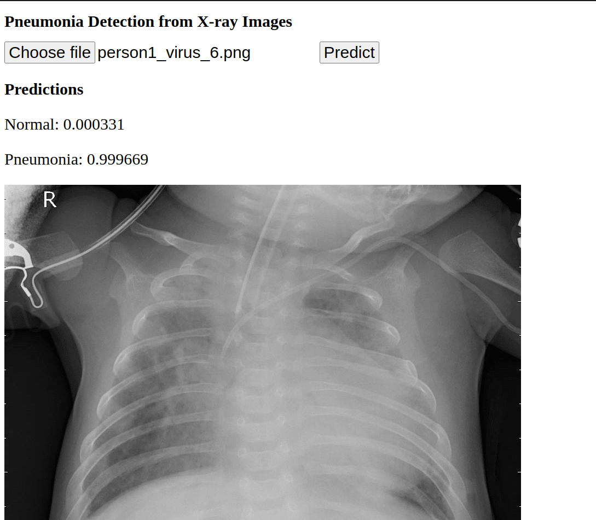

# Pneumonia Detection from X-ray Images

 Dataset is avaiable at [kaggle](https://www.kaggle.com/paultimothymooney/chest-xray-pneumonia)
 
 ## Requirements
 Install `virtualenv` using `pip`
 ```
$ pip install virtualenv
 ```
 Create virualenv with any name
 ```
 $ virtualenv app_env
 ```
 Activate the virtualenv
 ```
 $ source app_env/bin/activate
 ```
 Install the following libraries to run the app
 ```
 $ pip install flask
 $ pip install Pillow
 $ pip install pybase64
 $ pip install keras
 ```
 
 ## Deployment
 - Save the traied model
 - Run app.py file in virtualenv
 - Naviagate to browser and enter this url http://127.0.0.1:5000/static/predict.html
 - Upload the x-ray image and hit predict button
 
 
